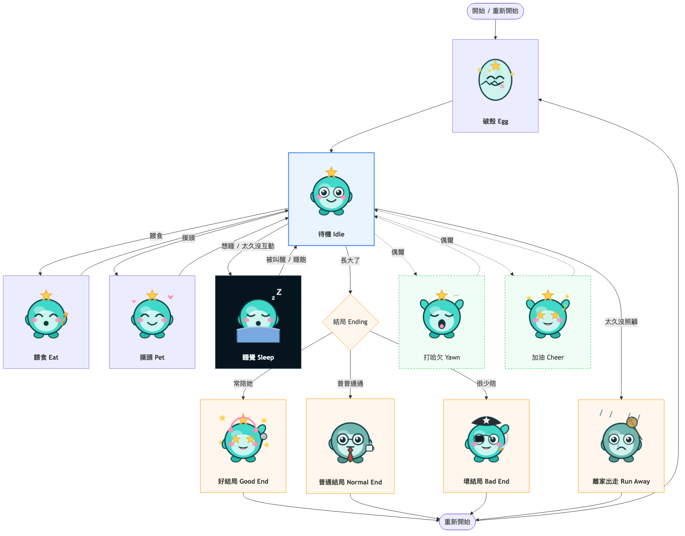

# HoloTamagotchi

建構在 **M5Stack Fire** 上的 Hololive 粉絲向電子雞遊戲。韌體為 **Arduino C++（PlatformIO / M5Unified）**。

> 由 UIFlow1 MicroPython 遷移而來。核心變更：用 M5GFX 的 **M5Canvas 全螢幕雙緩衝**——每幀在
> PSRAM 拼好整張畫面再一次 `pushSprite`，根治原本 `lcd.image` 逐列更新（掃描線）的問題。
> 美術素材不再編進韌體，改放 **LittleFS 分區**、開機載入 PSRAM（見下方「美術素材流程」）。

開發方式：Fire 接 USB，`pio run -t upload` 燒韌體；`pio run -t uploadfs` 燒素材分區。

---

## 目錄結構

模組化架構，目標：高擴充性（多角色 / 多語言）、邏輯與美術解耦。

```
HoloTamagotchi/
├─ device/                      # 韌體（M5Stack Fire / Arduino C++ / M5Unified）
│  ├─ platformio.ini            #   建置設定（板子 / 分區表 / LittleFS）
│  ├─ src/
│  │  ├─ main.cpp               #     進入點：建立 canvas、Game、狀態機主迴圈
│  │  ├─ config.h               #     全域設定（數值閾值、色票、狀態 ID）— 調平衡先動這
│  │  ├─ dev.h / dev.cpp        #     DEV 覆寫（編譯期常數；config::DEV 控制）
│  │  ├─ Metrics.{h,cpp}        #     核心數值系統（成長/飽食/疲勞/音遊率）
│  │  ├─ i18n.{h,cpp}           #     多國語言字串
│  │  ├─ AssetManager.{h,cpp}   #     繪圖：有圖畫圖，沒圖畫「色塊+標籤/寵物臉」佔位
│  │  ├─ AssetStore.{h,cpp}     #     開機從 LittleFS 載入素材到 PSRAM，注入 AssetManager
│  │  ├─ ui.{h,cpp}             #     共用 UI（對話框 / 選單）
│  │  ├─ states/                #     狀態機，一狀態一類（Init/NormalRoom/Feeding/Sleeping/Petting/Ending）
│  │  └─ assets/characters/     #     角色「靜態」資料（型別 + 各角色 SPRITES/主題色 + registry）
│  │     └─ marine/character.h  #       寶鐘瑪琳：色彩主題 / 佔位規格（圖片已外移 LittleFS）
│  ├─ tools/build_fs_assets.py  #   PNG → RGB565 → data/<角色>/（素材分區來源）
│  └─ data/                     #   LittleFS 來源（build_fs_assets.py 產生，gitignore；buildfs 打包）
├─ web/                         # 動畫模擬器（瀏覽器預覽真機播放）＋ demo-assets（PNG 美術源）
└─ docs/                        # 狀態機 / 給美術的狀態總覽
```

### 核心數值（config.h 可調）

| 變數 | 說明 | 結局關聯 |
|------|------|----------|
| GrowthIndex | 成長指數，隨時間 +，滿 100 | 觸發正常結局 |
| BasicLifeIndex | 飽食度，隨時間 −，餵食 + | < 0 → 壞結局（離家出走） |
| SleepIndex | 疲勞，隨時間 +，睡眠恢復 | 過高打哈欠 / 達標強制睡眠 |
| RhythmGameRate | 音遊互動率 % | >90 偶像 / 30–90 上班族 / <30 海賊 |

---

## 環境準備（只做一次）

安裝 [PlatformIO Core](https://platformio.org/install/cli)（`pip install platformio`，或用 VS Code PlatformIO 擴充）。
素材轉檔需要 Pillow：`pip install pillow`。

> 本機若 `pio` 不在 PATH，可用 `python3 -m platformio ...` 代替。

---

## 建置 / 上板

```bash
cd device
pio run                 # 編譯韌體
pio run -t upload       # 燒錄韌體（邏輯有改才需要）
pio run -t uploadfs     # 燒錄素材分區（換美術只需這步）
pio device monitor      # 看 Serial（對應原本的 print debug）
```

### 懶人捷徑 `./dev.sh`

包一層 `python3 -m platformio`，免打一長串（本機 `pio` 不在 PATH 時尤其方便）：

```bash
cd device
./dev.sh up      # 編譯 + 燒錄韌體 ← 改邏輯後最常用
./dev.sh mon     # 看 Serial log
./dev.sh dev     # 燒完直接接 monitor（up + mon 一氣呵成）
./dev.sh build   # 只編譯不燒
./dev.sh fs      # 換美術：buildfs + uploadfs
./dev.sh clean   # 清 build 快取
```

不帶參數預設等同 `up`。

分區表用內建 `default_16MB.csv`：app 在 `0x10000`，素材（LittleFS，label `spiffs`）在 `0xc90000`、約 3.4 MB。

---

## 美術素材流程（換圖只要轉檔 + 燒素材分區）

素材**不編進韌體**：來源 PNG 在 [web/demo-assets/](web/demo-assets)，轉成 raw RGB565 放進
`device/data/<角色>/`，打包成 LittleFS 映像燒到素材分區，韌體開機由 `AssetStore` 載入 PSRAM。

```bash
cd device
python3 tools/build_fs_assets.py   # web/demo-assets/*.png → data/marine/*.565 + manifest.txt
pio run -t buildfs                 # data/ → littlefs.bin
pio run -t uploadfs                # 燒進素材分區（不必重燒韌體）
```

- 檔名規則：`<基底>_NN.png`（`NN`=00,01,02… 幀號），多幀自動輪播。
- 對應關係：[tools/build_fs_assets.py](device/tools/build_fs_assets.py) 開頭的 `MAP` 表（manifest key → 來源基底）。
  換現有 key 的圖只要替換 PNG 重跑；**新增一種圖**就在 `MAP` 加一行。
- 去背：PNG `alpha<128` 寫成洋紅透明色鍵 `0xF81F`（背景設不透明）。
- 佔位規格（key / 預設尺寸 / 標籤）在 [marine/character.h](device/src/assets/characters/marine/character.h) 的 `SPRITES[]`；
  換尺寸時這裡要與 PNG 一起改。
- **沒有素材分區也能跑**：`AssetStore` 載入失敗時，畫面自動退回「色塊 + 標籤 / 寵物臉」佔位，遊戲流程照常可測。

> 官網 [HoloTamagotchi_homepage](../HoloTamagotchi_homepage) 用 esptool-js 在瀏覽器直接燒這些 bin
> （共用韌體 + 每包一顆素材分區），素材包切換只需重燒 `0xc90000` 那顆。

---

## DEV / PROD 模式

由 [config.h](device/src/config.h) 的 `DEV` 旗標切換（改完重編、重燒）：

| `DEV` | 畫面 | 用途 |
|-------|------|------|
| `true`（預設） | 疊一層 debug overlay：底部 `DEV <state> G.. L.. E.. R..%` | 開發時即時看核心數值 / 目前狀態 |
| `false` | 乾淨遊戲介面（靠角色動作表現） | 正式展示 / 給玩家 |

快速重現情境：改 [dev.h](device/src/dev.h) 的編譯期常數（`START_STATE` 強制起始狀態、`FREEZE` 凍結數值、
`TIME_SCALE` 數值倍速、`SKIP_IMU` 跳過 IMU），重編即生效。原 Python 版的 `dev_data.py` 延遲載入死鎖是
MicroPython 專屬問題，C++ 無此問題，故簡化為常數。

真機按鍵：**A / B / C**（普通房間 C=選單，選單內 A/C 移動、B 確認）。

---

## 文件

| 文件 | 內容 |
|------|------|
| [docs/character-states-for-art.md](docs/character-states-for-art.md) | **角色狀態總覽（給美術看的白話版）** — 六大場景、心情、交付清單 |
| [docs/character-states-for-art.en.md](docs/character-states-for-art.en.md) | 同上英文版 / Artist-friendly states overview (English) |
| [docs/character-state-machine.md](docs/character-state-machine.md) | 角色狀態機（技術版）— 觸發條件、數值規則、config 常數 |
| [web/README.md](web/README.md) | 動畫模擬器（瀏覽器預覽真機播放） |



---

## 疑難排解

| 症狀 | 處理 |
|------|------|
| 開機畫面全是色塊 / 標籤，沒有真圖 | 還沒燒素材分區：`pio run -t buildfs && pio run -t uploadfs`。Serial 會印 `[AssetStore] ...` |
| `[AssetStore] LittleFS 掛載失敗` | 素材分區沒燒或分區表不符；確認 `platformio.ini` 用 `default_16MB.csv` 後重燒 fs |
| 顏色像負片（暖↔冷反轉） | `main.cpp` 的 `canvas.setSwapBytes(true)` 被改動；RGB565 資料是原生位元組序，需開此旗標 |
| 上傳找不到序列埠 | 確認 USB 線可傳輸資料、Fire 已開機；`pio device list` 查埠；重插或換線 |
| 按鍵有爆音/底噪 | M5 喇叭 DAC 殘留噪音；`main.cpp` 啟動會靜音喇叭 |
