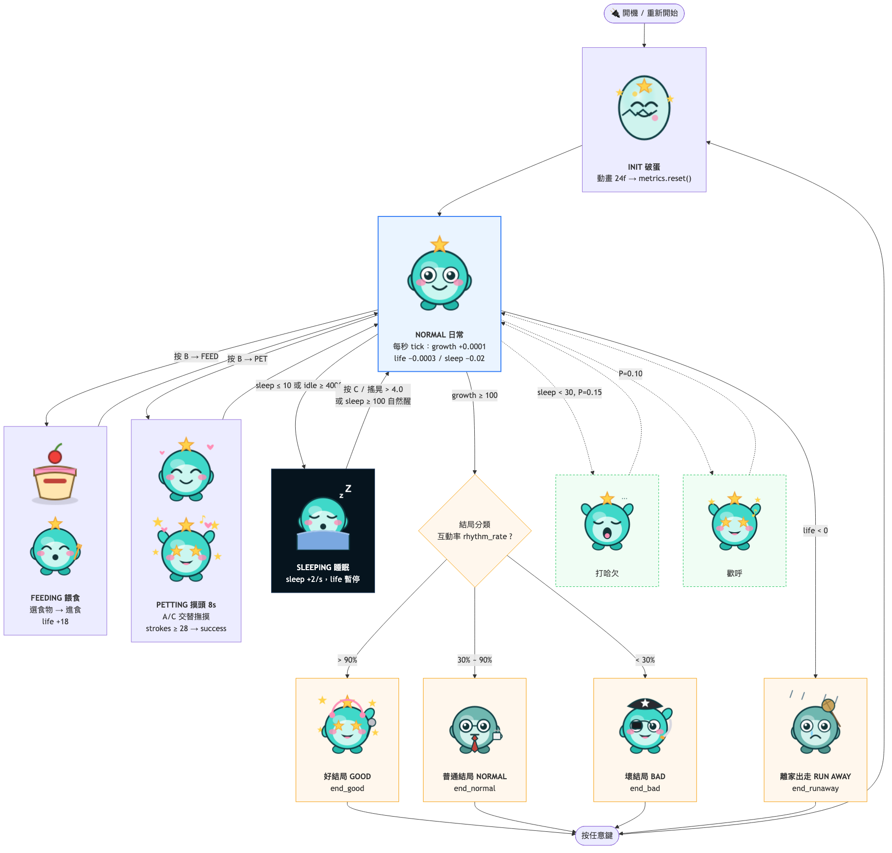
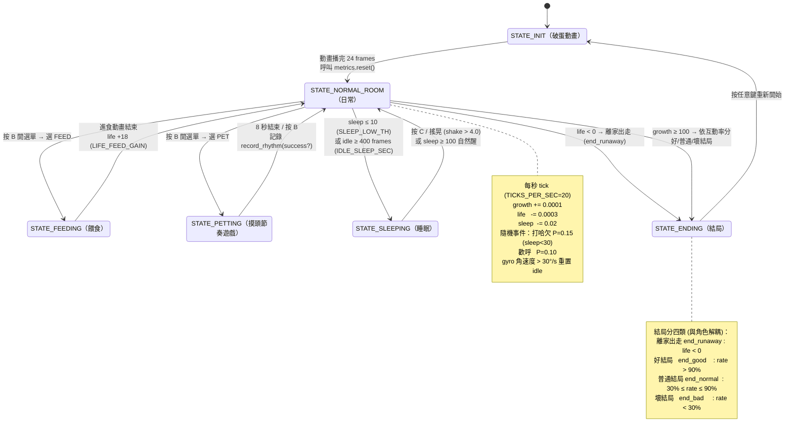

# 角色狀態機（Character State Machine）

本文件整理 HoloTamagotchi 角色的狀態與觸發條件，來源為 `device/` 內的狀態程式與 `device/config.py` 參數。

## 線狀流程圖（含角色範例圖）

每個狀態節點都嵌入了 `web/demo-assets/` 的對應 sprite，方便對照畫面：

> 此圖由 `mmdc` 渲染，原始碼見下方。圖中範例圖：破蛋 `egg`、日常 `idle`、餵食 `food`/`eat`、摸頭 `pet`/`emo_success`、睡眠 `sleep`、隨機事件 `yawn`/`cheer`、四類結局 `end_good`/`end_normal`/`end_bad`/`end_runaway`（範例素材沿用 marine 的 idol/office/pirate 圖）。

## 狀態流程圖（純文字版）

## 核心數值（Metrics）

| 變數 | 範圍 | 變化規則 | 觸發 |
|------|------|----------|------|
| `growth` | 0–100 | 醒著 +0.0001/s | ≥100 → 成長結局（約 11.6 天） |
| `life` | 0–100 | 醒著 -0.0003/s；睡眠暫停；餵食 +18 | <0 → 離家出走（end_runaway） |
| `sleep` | 0–100 | 醒著 -0.02/s；睡眠 +2.0/s | ≤10 → 睡覺；≥100 → 自然醒 |
| `rhythm_rate` | 0–100% | `rhythm_plays / total_interactions` | 決定結局分支 |

## 各狀態觸發條件細節

### STATE_INIT
- 進入：開機或結局後重新開始（`main.py:166`）
- 離開：破蛋動畫播完 24 frames（約 1.2 秒）→ NORMAL_ROOM（`init_state.py:38-39`）

### STATE_NORMAL_ROOM
- 每秒 tick 更新 growth / life / sleep（`normal_room.py:77-78`）
- 隨機事件：打哈欠（`sleep < SLEEP_YAWN_TH=30` 時 P=0.15）、歡呼（P=0.10）
- 離開條件：
  - `life < 0` → ENDING（runaway）（`normal_room.py:82-84`）
  - `growth ≥ 100` → ENDING（`normal_room.py:85-87`）
  - `sleep ≤ 10` 或 idle ≥ 400 frames → SLEEPING（`normal_room.py:96-98`）
  - 按 B → 選單 → FEED/PET（`normal_room.py:127-139`）
  - gyro 角速度 > `IDLE_MOTION_TH=30°/s` 重置 idle 計數

### STATE_FEEDING
- 選單選食物（food_0~4）→ 進食動畫（約 2.1 秒）
- `feed()`：`life += 18`（夾在 -20..100），`total_interactions += 1`
- 動畫結束 → NORMAL_ROOM（`feeding.py:88`）

### STATE_PETTING
- 一局 8 秒（`SESSION_SEC × TICKS_PER_SEC = 160 frames`）
- A=左撫摸、C=右撫摸，需左右交替才算有效 stroke
- 成功：`strokes ≥ PET_SUCCESS_STROKES=28`；逾時 → 失敗
- `record_rhythm(success)` 更新 `rhythm_plays / rhythm_sa / total_interactions`
- 按 B → NORMAL_ROOM（`petting.py:182`）

### STATE_SLEEPING
- 背景轉深藍，呼吸動畫；`life` 暫停下降，`sleep += 2.0/s`
- 離開條件：
  - 按 C → `sleep = 100`，回 NORMAL_ROOM（`sleeping.py:81-83`）
  - 搖晃：leak integrator `shake = shake×0.75 + gyro×0.02`，`> SHAKE_WAKE_TH=4.0` 喚醒
  - `sleep ≥ 100` 自然醒（`sleeping.py:85-86`）

### STATE_ENDING
- 結局分四類（與角色解耦，未來換遊戲只需替換 `end_*` 素材）：
  - `end_runaway` 離家出走（life<0）、`end_good` 好結局（rate>90%）、`end_normal` 普通結局（30–90%）、`end_bad` 壞結局（rate<30%）
- 按任意鍵 → INIT（重新開始，`ending.py:40`）

## 關鍵常數（config.py）

| 常數 | 值 | 意義 |
|------|----|------|
| `TICKS_PER_SEC` | 20 | 每秒 frame 數 |
| `GROWTH_MAX` | 100 | 成長結局門檻 |
| `LIFE_INIT` | 80 | life 初始值 |
| `LIFE_FEED_GAIN` | 18 | 餵食回復量 |
| `SLEEP_LOW_TH` | 10 | 疲倦（強制睡）門檻 |
| `SLEEP_YAWN_TH` | 30 | 打哈欠門檻 |
| `SLEEP_FULL` | 100 | 自然醒門檻 |
| `IDLE_SLEEP_SEC` | 20 | 閒置自動睡（正式版 3600=1hr） |
| `IDLE_MOTION_TH` | 30 | 重置 idle 的 gyro 角速度(°/s) |
| `SHAKE_WAKE_TH` | 4.0 | 搖醒門檻 |
| `PET_SUCCESS_STROKES` | 28 | 摸頭過關所需 stroke |
| `END_GOOD_TH` | 90 | 好結局門檻(%) |
| `END_NORMAL_TH` | 30 | 普通/壞結局分界(%) |
