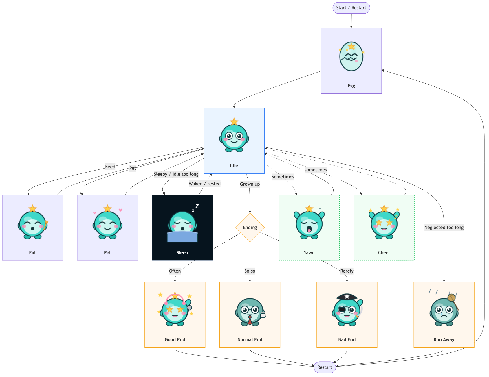
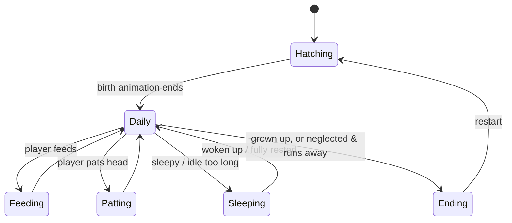

# Character States Overview (Artist-Friendly Version)

This doc explains, in plain language, the different "scenes/screens" the HoloTamagotchi character has, what she's doing in each, her mood, and what art is needed.
(For code details and exact numbers, see [character-state-machine.md](character-state-machine.md).)

## One-Line Pitch

It's a care-raising game: the character is born from an **egg**, the player takes care of her by **feeding**, **head-patting**, and **putting her to sleep**, and depending on how well she's cared for, the story reaches one of several **endings**.

## Flow Diagram (with sample art)

Each scene embeds a sample sprite from [web/demo-assets/](../web/demo-assets/) for visual reference:

> Sample art reuses marine's idol/office/pirate sprites — for style reference only. Text-only flow below:

## Six Scenes & What Art They Need

| Scene | What she's doing | Mood | Art needed |
|-------|------------------|------|------------|
| **① Hatching** | Being born from an egg | Anticipation, cute | Egg → cracking → character appears (animation) |
| **② Daily** | Hanging out in her room, occasionally yawning or cheering | Relaxed, natural | Idle loop, yawn, cheer |
| **③ Feeding** | Eating | Satisfied, happy | Food items, eating animation |
| **④ Patting** | Head-pat mini-game (stroke left & right alternately) | Shy, content, super happy on success | Head-pat animation, success expression |
| **⑤ Sleeping** | Sleeping with eyes closed, gentle breathing | Peaceful | Sleeping animation (dark-blue night mood) |
| **⑥ Ending** | Story wrap-up | Varies by ending | Four ending images (see below) |

## Scene Details

### ① Hatching
- Plays at the start of the game, or when restarting after an ending.
- A short animation: the egg slowly cracks open and the character appears.

### ② Daily (the main screen)
- The character's default idle screen, hanging out in her room.
- Two random little actions keep the screen lively:
  - **Yawn**: appears more often when she's getting sleepy.
  - **Cheer / happy**: pops up occasionally at random.
- From here the player can choose to **feed** or **pat** her.

### ③ Feeding
- The player picks a food from a menu to give her.
- An eating animation plays, then it returns to Daily.
- Feeding restores her energy (so she doesn't get so hungry she runs away).

### ④ Patting (rhythm mini-game)
- One round lasts about 8 seconds; the player strokes her head **alternating left and right**.
- Enough successful strokes → she shows a super-happy success expression.
- Not enough → counts as a miss (no penalty, but no bonus either).
- Needs: a head-pat animation, plus a "success" happy close-up expression.

### ⑤ Sleeping
- When she gets sleepy, or the player is idle too long, she falls asleep automatically.
- The mood shifts to a **dark-blue night** look; eyes closed, with a breathing-like rise and fall.
- The player can wake her (button press or shaking the device), or let her wake up naturally once fully rested.

### ⑥ Ending (four types)
When she grows up, or is neglected for too long, the story reaches an ending. There are four ending types, **independent of the character design** (a future character can reuse the same ending logic — just swap the art):

| Ending | When it happens | Mood |
|--------|-----------------|------|
| **Good** | Player interacted with her often | Happy, fulfilling |
| **Normal** | Cared for so-so | Plain, gentle |
| **Bad** | Rarely spent time with her | Sad, regretful |
| **Runaway** | Neglected too long, energy hit zero | Heartbroken, empty room |

After the ending plays, pressing any key returns to Hatching to start a new round.

## Art Delivery Checklist (TL;DR)

Roughly the assets needed (please provide animations as frame sequences):

1. **Hatching**: egg → cracking → reveal
2. **Daily idle**: basic idle loop
3. **Yawn**
4. **Cheer / happy**
5. **Food**: several food items
6. **Eating**
7. **Head-pat** + **head-pat success happy expression**
8. **Sleeping** (dark-blue night mood)
9. **Four ending images**: good / normal / bad / runaway

> The current demo placeholder assets live in [web/demo-assets/](../web/demo-assets/) — use them as a reference for size and style.
