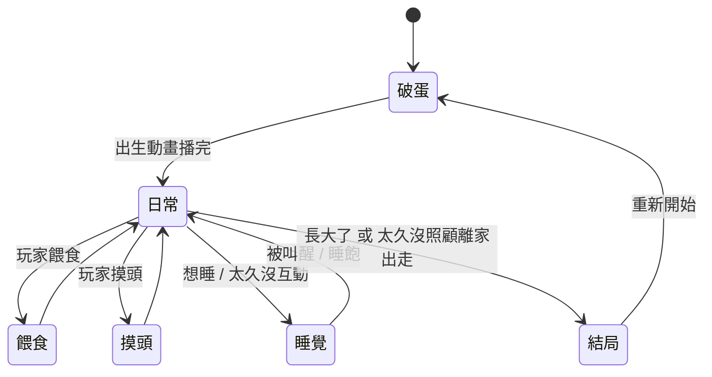

# 角色狀態總覽（給美術看的版本）

這份文件用最白話的方式，說明 HoloTamagotchi 角色一共有哪些「畫面/場景」、每個場景角色在做什麼、心情如何，以及需要哪些圖。
（想看程式細節與數值，請看 [character-state-machine.md](character-state-machine.md)。）

## 一句話介紹

這是一個養成小遊戲：角色從「破蛋」出生，玩家透過**餵食**、**摸頭**、**哄睡**來照顧她，最後依照玩家照顧得好不好，走向不同的**結局**。

## 流程圖（含範例圖）

每個場景都嵌入了 [web/demo-assets/](../web/demo-assets/) 的範例 sprite，方便對照畫面：

> 範例素材沿用 marine 的 idol/office/pirate 圖，僅供風格參考。純文字版流程如下：

## 六大場景，需要哪些圖

| 場景 | 角色在做什麼 | 心情 | 需要的圖 |
|------|-------------|------|----------|
| **① 破蛋** | 從蛋裡誕生 | 期待、可愛 | 蛋 → 破殼 → 角色登場的動畫 |
| **② 日常** | 在房間裡待著、偶爾打哈欠或開心歡呼 | 放鬆、自然 | 待機動畫、打哈欠、歡呼 |
| **③ 餵食** | 吃東西 | 滿足、開心 | 食物圖、吃東西動畫 |
| **④ 摸頭** | 被摸頭的小遊戲（左右輪流撫摸） | 害羞、舒服、成功時超開心 | 被摸頭動畫、成功表情 |
| **⑤ 睡覺** | 閉眼睡覺、呼吸起伏 | 安詳 | 睡覺動畫（背景偏深藍夜晚感） |
| **⑥ 結局** | 故事收尾 | 依結局不同 | 四張結局圖（見下） |

## 各場景細節

### ① 破蛋
- 遊戲一開始、或結局後重新開始時播放。
- 是一段短動畫：蛋慢慢裂開，角色登場。

### ② 日常（最主要的畫面）
- 角色平時待在房間裡的待機畫面。
- 會隨機出現兩種小動作讓畫面更生動：
  - **打哈欠**：當角色想睡的時候比較常出現。
  - **歡呼 / 開心**：偶爾隨機出現。
- 玩家可以從這裡選擇「餵食」或「摸頭」。

### ③ 餵食
- 玩家從選單挑食物給角色吃。
- 播放一段吃東西的動畫，吃完回到日常。
- 餵食會讓角色更有活力（避免她餓到離家出走）。

### ④ 摸頭（節奏小遊戲）
- 一局大約 8 秒，玩家要**左右輪流**撫摸角色的頭。
- 成功撫摸足夠次數 → 角色露出超開心的成功表情。
- 沒摸夠 → 算失敗（沒有懲罰，但不會加分）。
- 需要：被摸頭的動畫、以及一個「成功」的開心特寫表情。

### ⑤ 睡覺
- 當角色想睡，或玩家太久沒互動時，會自動進入睡眠。
- 畫面氛圍轉成**深藍夜晚**，角色閉眼、有呼吸般的起伏。
- 玩家可以叫醒她（按鍵或搖晃裝置），或讓她自然睡飽醒來。

### ⑥ 結局（共四種）
角色長大、或被冷落太久時，會進入結局。結局共分四類，**和角色設定無關**（之後換不同角色也能共用同一套結局邏輯，只要換圖）：

| 結局 | 觸發情境 | 氣氛 |
|------|----------|------|
| **好結局** | 玩家很常陪她互動 | 幸福、圓滿 |
| **普通結局** | 照顧得普普通通 | 平淡、溫和 |
| **壞結局** | 很少陪她 | 失落、遺憾 |
| **離家出走** | 太久沒餵、活力歸零 | 難過、空蕩的房間 |

結局播完後，按任意鍵就會回到破蛋，重新開始一輪。

## 美術交付清單（懶人包）

需要的圖大致如下（動畫請以序列幀提供）：

1. **破蛋**：蛋 → 破殼 → 登場
2. **日常待機**：基本待機循環
3. **打哈欠**
4. **歡呼 / 開心**
5. **食物**：數種食物圖
6. **吃東西**
7. **被摸頭** + **摸頭成功的開心表情**
8. **睡覺**（深藍夜晚氛圍）
9. **四種結局圖**：好 / 普通 / 壞 / 離家出走

> 目前 demo 使用的範例素材放在 [web/demo-assets/](../web/demo-assets/)，可作為尺寸與風格的參考。
